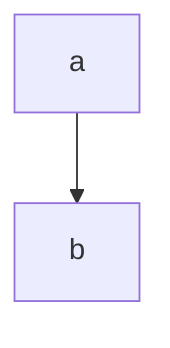

---
#Tùy chỉnh thông tin
university: Đại học Quốc gia Hà Nội # Tên đại học
collage: Trường Đại học Khoa học Tự nhiên # Tên trường
faculty: Khoa Toán - Cơ - Tin học # Tên khoa
subject: Thực tập thực tế phát triển phần mềm # Tên môn học
major: Toán tin # Ngành học
title: Tool tạo pdf báo cáo từ markdown # Tên đề tài
subtitle: Báo cáo cuối môn học # Tên phụ
instructor: Phan Thanh Ngọc # Tên giáo viên hướng dẫn
author:
  - name: Phan Thanh Ngọc # Tên tác giả
    id: 20000001 # Mã số sinh viên
  - name: Phan Thanh Ngọc # Tên tác giả
    id: 20000001 # Mã số sinh viên
position: Hà Nội
day: 05 # Ngày
month: 11 # Tháng
year: 2023 # Năm
logo: "image/HUS Logo.jpg"
---
# Lời mở đầu {-}
Tui xin tự cảm ơn tui vì lười gõ latex mà lại chăm ngồi code latex để đẻ ra con này

:::sign
Sinh viên
:::

`\toc`{=latex} <!--cho mục lục-->

# Ví dụ cách sử dụng 

## Đoạn văn

Đây là một đoạn văn ví dụ. Trích dẫn theo [@texbook]: "Lorem ipsum dolor sit amet, consectetur adipiscing elit. Maecenas sagittis eleifend molestie. In fringilla enim dolor. Praesent lacinia dui velit, at ullamcorper orci laoreet non. Nullam placerat efficitur leo a ornare. Duis condimentum, tortor vitae pellentesque venenatis, lorem urna gravida nibh, a fermentum est nunc at magna. Sed posuere arcu odio, posuere porta libero eleifend vel. Maecenas ut metus quam. Praesent vitae euismod nisl. Morbi tincidunt nulla eget lacus sagittis aliquet. Aliquam condimentum commodo lacus, quis convallis quam volutpat id. Proin lobortis, sapien et fermentum faucibus, lacus est tincidunt augue, quis facilisis elit nisi non nisl. Donec et odio sit amet ligula laoreet convallis non quis nulla."

Đoạn văn thứ 2. Chân trang [^ref]

[^ref]: Chân trang

## Bảng biểu 

+---------------------+-----------------------+
| Location            | Temperature 1961-1990 |
|                     | in degree Celsius     |
|                     +-------+-------+-------+
|                     | min   | mean  | max   |
+=====================+=======+=======+=======+
| Antarctica          | -89.2 | N/A   | 19.8  |
+---------------------+-------+-------+-------+
| Earth               | -89.2 | 14    | 56.7  |
+---------------------+-------+-------+-------+
: Bảng phức tạp


| Right | Left | Default | Center |
|------:|:-----|---------|:------:|
|   12  |  12  |    12   |    12  |
|  123  |  123 |   123   |   123  |
|    1  |    1 |     1   |     1  |
: Bảng đơn giản

## Hình ảnh 




### Code

Inline: `print("hello")`{.python}

code block:
``` { .python caption="hello world"}
print("hello")
```

Thêm từ file
```{include="refs.bib"}
```

### Biểu thức toán học 

Inline: $a+b$

Block:
$$a+b$$

# Tài liệu tham khảo 

::: {#refs-main}
:::

# Phụ lục
